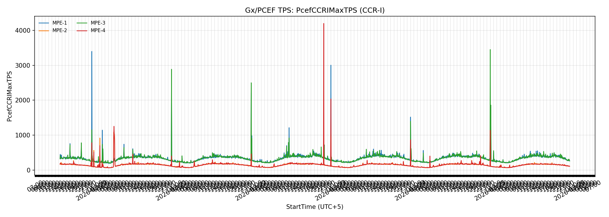
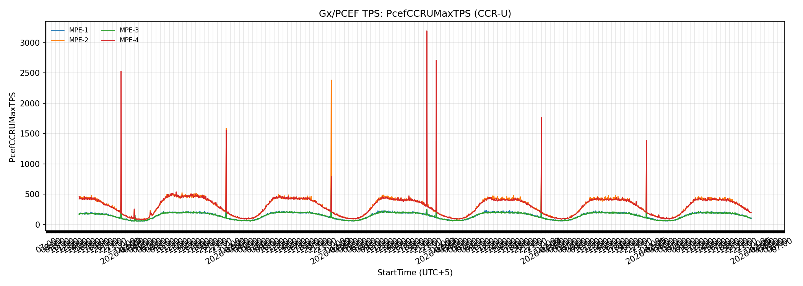
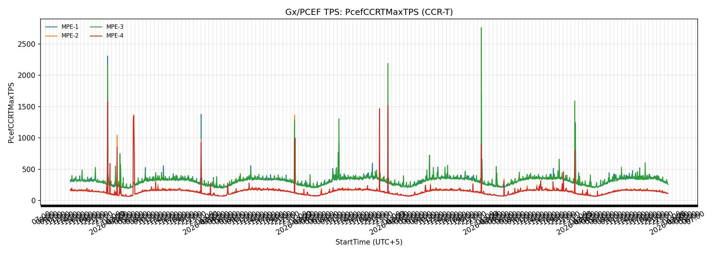
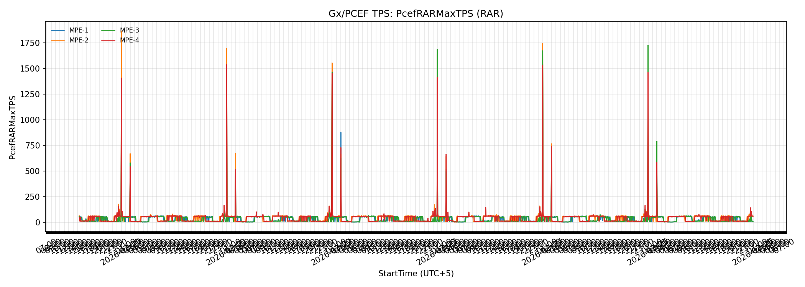
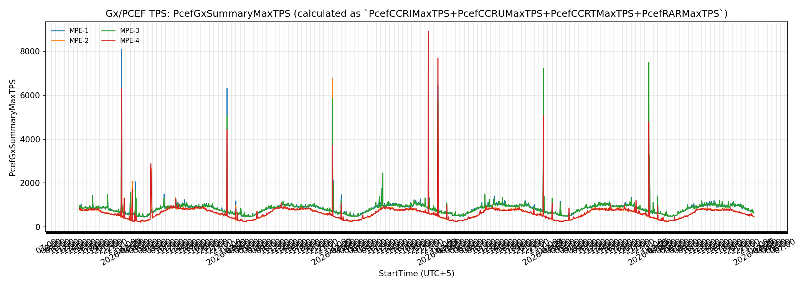

# PCRF Charts

Source panels: `pcrf_graph_suggester_output.md`

## Diameter Errors

- Skipped: `DiameterTooBusyReceived` (no files match `ProtocolErrorStats-*.csv`)

- Skipped: `DiameterTooBusySent` (no files match `ProtocolErrorStats-*.csv`)

- Skipped: `DiameterUnableToDeliverReceived` (no files match `ProtocolErrorStats-*.csv`)

- Skipped: `DiameterUnableToDeliverSent` (no files match `ProtocolErrorStats-*.csv`)

- Skipped: `DiameterUnknownSessionIdReceived` (no files match `ProtocolErrorStats-*.csv`)

- Skipped: `DiameterUnknownSessionIdSent` (no files match `ProtocolErrorStats-*.csv`)

- Skipped: `DiameterUnableToComplyReceived` (no files match `ProtocolErrorStats-*.csv`)

- Skipped: `DiameterUnableToComplySent` (no files match `ProtocolErrorStats-*.csv`)

## Gx/PCEF TPS

- `PcefCCRIMaxTPS` -> `gx_pcef_tps__pcefccrimaxtps.png`

- `PcefCCRUMaxTPS` -> `gx_pcef_tps__pcefccrumaxtps.png`

- `PcefCCRTMaxTPS` -> `gx_pcef_tps__pcefccrtmaxtps.png`

- `PcefRARMaxTPS` -> `gx_pcef_tps__pcefrarmaxtps.png`

- `PcefGxSummaryMaxTPS` -> `gx_pcef_tps__pcefgxsummarymaxtps.png`

## MPE Overview

- `MaxTransactionsPerSecond` -> `mpe_overview__maxtransactionspersecond.png`

- `MaxTPSPercentageOfCapacity` -> `mpe_overview__maxtpspercentageofcapacity.png`

- `CurrentSessionCount` -> `mpe_overview__currentsessioncount.png`

- `CurrentSessionPercentageOfCapacity` -> `mpe_overview__currentsessionpercentageofcapacity.png`

- `CurrentPDNConnectionCount` -> `mpe_overview__currentpdnconnectioncount.png`

- `CurrentPDNConnectionPercentageOfCapacity` -> `mpe_overview__currentpdnconnectionpercentageofcapacity.png`

- `LoadSheddingStatus` -> `mpe_overview__loadsheddingstatus.png`

- `LoadSheddingEfficiency` -> `mpe_overview__loadsheddingefficiency.png`

- `LoadSheddingDistressCount` -> `mpe_overview__loadsheddingdistresscount.png`

- `PrimaryCPUUtilizationPercentage` -> `mpe_overview__primarycpuutilizationpercentage.png`

- `PrimaryMemoryUtilizationPercentage` -> `mpe_overview__primarymemoryutilizationpercentage.png`

- `PrimaryDiskUtilizationPercentage` -> `mpe_overview__primarydiskutilizationpercentage.png`

- `CurrentProtocolErrorSentCount` -> `mpe_overview__currentprotocolerrorsentcount.png`

- `CurrentProtocolErrorReceivedCount` -> `mpe_overview__currentprotocolerrorreceivedcount.png`

## PFE/MRA Overview

- Skipped: `PcefCCRIMaxTPS` (no files match `TpsMraStats-*.csv`)

- Skipped: `PcefCCRUMaxTPS` (no files match `TpsMraStats-*.csv`)

- Skipped: `PcefCCRTMaxTPS` (no files match `TpsMraStats-*.csv`)

- Skipped: `PcefRARMaxTPS` (no files match `TpsMraStats-*.csv`)

- Skipped: `PcefGxSummaryMaxTPS` (no files match `TpsMraStats-*.csv`)

- Skipped: `AverageTransactionOutProcessingTime` (no files match `DiameterMraPcefLatencyStats-*.csv`)

- Skipped: `MaxTransactionOutProcessingTime` (no files match `DiameterMraPcefLatencyStats-*.csv`)

- Skipped: `CCRIMessagesTimeoutCount` (no files match `DiameterMraPcefStats-*.csv`)

- Skipped: `PeerDownCount` (no files match `DiameterMraPcefStats-*.csv`)

## Sh Data Source

- Skipped: `SuccessfulSearchCount` (no files match `ShDataSourceStats-*.csv`)

- Skipped: `SearchErrorCount` (no files match `ShDataSourceStats-*.csv`)

- Skipped: `AvgSuccessfulSearchTimeTaken` (no files match `ShDataSourceStats-*.csv`)

- Skipped: `MaxSuccessfulSearchTimeTaken` (no files match `ShDataSourceStats-*.csv`)

## Sh Health

- `UDRMessagesTimeoutCount` -> `sh_health__udrmessagestimeoutcount.png`

- `SNRMessagesTimeoutCount` -> `sh_health__snrmessagestimeoutcount.png`

- `PeerDownCount` -> `sh_health__peerdowncount.png`

- `CurrentConnectionsCount` -> `sh_health__currentconnectionscount.png`

## Sh Latency

- Skipped: `AverageTransactionOutProcessingTime` (no files match `DiameterShLatencyStats-*.csv`)

- Skipped: `MaxTransactionOutProcessingTime` (no files match `DiameterShLatencyStats-*.csv`)

- Skipped: `TransactionTime_Out_gt_200_Count` (no files match `DiameterShLatencyStats-*.csv`)

## Sh TPS

- `ShUDRSentTCurrentTPS` -> `sh_tps__shudrsenttcurrenttps.png`

- `ShPNRCurrentTPS` -> `sh_tps__shpnrcurrenttps.png`

- `ShPURCurrentTPS` -> `sh_tps__shpurcurrenttps.png`

- `ShSNRCurrentTPS` -> `sh_tps__shsnrcurrenttps.png`

## Sy Data Source

- Skipped: `SuccessfulSearchCount` (no files match `SyDataSourceStats-*.csv`)

- Skipped: `UnsuccessfulSearchCount` (no files match `SyDataSourceStats-*.csv`)

- Skipped: `AvgSuccessfulSearchTimeTaken` (no files match `SyDataSourceStats-*.csv`)

- Skipped: `AvgUnsuccessfulSearchTimeTaken` (no files match `SyDataSourceStats-*.csv`)

## Sy Health

- Skipped: `SLRMessagesTimeoutCount` (no files match `DiameterSyStats-*.csv`)

- Skipped: `SLRIMessagesTimeoutCount` (no files match `DiameterSyStats-*.csv`)

- Skipped: `STRMessagesTimeoutCount` (no files match `DiameterSyStats-*.csv`)

- Skipped: `PeerDownCount` (no files match `DiameterSyStats-*.csv`)

- Skipped: `CurrentConnectionsCount` (no files match `DiameterSyStats-*.csv`)

## Sy Latency

- Skipped: `AverageTransactionOutProcessingTime` (no files match `DiameterSyLatencyStats-*.csv`)

- Skipped: `MaxTransactionOutProcessingTime` (no files match `DiameterSyLatencyStats-*.csv`)

- Skipped: `TransactionTime_Out_gt_200_Count` (no files match `DiameterSyLatencyStats-*.csv`)

## Sy TPS

- `SySLRICurrentTPS` -> `sy_tps__syslricurrenttps.png`

- `SySLRUCurrentTPS` -> `sy_tps__syslrucurrenttps.png`

- `SySNRTCurrentTPS` -> `sy_tps__sysnrtcurrenttps.png`

- `SySTRCurrentTPS` -> `sy_tps__systrcurrenttps.png`

